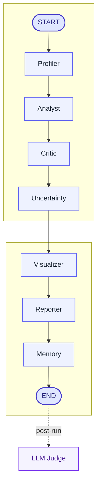

<p align="center">
  
</p>

<h1 align="center">AutoInsight-AI</h1>

<p align="center">
  A multi-agent data analysis system built with LangGraph, Streamlit, Ollama, ChromaDB, and optional LangFuse observability.
</p>

<p align="center">
  Upload a dataset, run one pipeline, and get profiling, insights, critique, uncertainty scores, charts, and a final report.
</p>

---

## Table of Contents

1. [Project Overview](#project-overview)
2. [Presentation Material](#presentation-material)
3. [What the App Does](#what-the-app-does)
4. [Architecture at a Glance](#architecture-at-a-glance)
5. [Tech Stack](#tech-stack)
6. [Repository Structure](#repository-structure)
7. [Quick Start for a Teacher or Evaluator](#quick-start-for-a-teacher-or-evaluator)
8. [Full Local Setup](#full-local-setup)
9. [Environment Configuration](#environment-configuration)
10. [Run the Application](#run-the-application)
11. [How to Test That It Works](#how-to-test-that-it-works)
12. [Optional LangFuse Observability](#optional-langfuse-observability)
13. [Sample Datasets](#sample-datasets)
14. [Useful Commands](#useful-commands)
15. [Troubleshooting](#troubleshooting)
16. [Authors](#authors)

---

## Project Overview

AutoInsight-AI is a multi-agent analytics application that transforms a tabular dataset into:

- a structured profile of the data
- business-oriented insights
- critique and confidence scoring
- automatically generated interactive charts
- an executive-style markdown report

The system is orchestrated with LangGraph: each agent is a node in a shared workflow, and the Streamlit app shows the pipeline status and the final outputs progressively.

---

## Presentation Material

The project presentation deck is available here:

- [AutoInsight_AI_Presentation.pptx](./AutoInsight_AI_Presentation.pptx)

For written technical documentation, see:

- [docs/README.md](./docs/README.md)

---

## What the App Does

For one uploaded file, the application runs the following workflow:



The automated pipeline ends at `END`. `LLM Judge` is a post-run evaluation feature shown in the app after the main pipeline completes.

Equivalent linear view:

```text
START
  -> Profiler
  -> Analyst
  -> Critic
  -> Uncertainty
  -> Visualizer
  -> Reporter
  -> Memory (RAG Storage)
END
```

### Agent roles

| Agent | Role |
|---|---|
| `Profiler` | Computes deterministic statistics, then produces a readable dataset profile |
| `Analyst` | Generates structured insights from the profile and data sample |
| `Critic` | Reviews the insights and challenges weak claims |
| `Uncertainty` | Assigns confidence scores to insights |
| `Visualizer` | Proposes and renders Plotly charts |
| `Reporter` | Synthesizes everything into a final executive report |
| `Memory (RAG Storage)` | Stores run artifacts in ChromaDB for future context reuse |

---

## Architecture at a Glance

### High-level flow

```text
User Upload
  -> Streamlit UI
  -> LangGraph Orchestration
  -> Specialized Agents
  -> Charts + Report + Diagnostics
  -> Optional Memory / Observability
```

### LLM routing

The project uses three Ollama model tiers for clean task routing:

| Tier | Default model | Typical use |
|---|---|---|
| `light` | `qwen3:4b` | Fast, lightweight text tasks |
| `text` | `qwen3:14b` | Main reasoning and report generation |
| `code` | `qwen2.5-coder:14b` | Chart code generation |

### Why LangGraph?

LangGraph is the orchestration backbone of the system. It is used to:

- define the execution order of the agents
- pass structured state from one node to the next
- stream partial progress to the UI
- keep the pipeline traceable and extensible

---

## Tech Stack

| Layer | Tools |
|---|---|
| Orchestration | LangGraph |
| LLM access | LangChain, Ollama, optional Gemini |
| UI | Streamlit |
| Data handling | pandas, NumPy, PyArrow, openpyxl |
| Visualization | Plotly |
| Memory | ChromaDB |
| Observability | LangFuse |
| Tooling | uv, Ruff, pytest, mypy, pre-commit |

---

## Repository Structure

```text
AutoInsight-AI/
├── agents/             # Agent implementations
├── app/                # Streamlit application
├── config/             # Settings and prompts
├── data/               # Small demo datasets
├── diagnostics/        # Pipeline diagnostics and status rendering
├── docs/               # Project documentation
├── evaluation/         # Evaluation and LLM-as-a-judge logic
├── orchestration/      # Canonical LangGraph state + graph
├── tests/              # Unit and integration tests
├── tools/              # Deterministic utilities
├── utils/              # Shared helpers: LLM, LangFuse, memory, prompts
└── visualization/      # Chart schemas, parsing, execution
```

---

## Quick Start for a Teacher or Evaluator

If you want the shortest reliable path to verify the project:

### 1. Prerequisites

- Python `3.11+` installed, with `3.11` or `3.12` recommended
- `uv` installed
- Ollama installed and running locally

### 2. Install dependencies

```bash
uv sync --extra dev
```

You do not need to activate a virtual environment manually if you use `uv run` and the provided `make` commands.

### 3. Prepare environment

```bash
cp .env.example .env
```

Then edit `.env` and use the local Ollama setup:

```dotenv
LLM_PROVIDER=ollama
OLLAMA_BASE_URL=http://localhost:11434
OLLAMA_LIGHT_MODEL=qwen3:4b
OLLAMA_TEXT_MODEL=qwen3:14b
OLLAMA_CODE_MODEL=qwen2.5-coder:14b
LANGFUSE_ENABLED=false
```

### 4. Pull the required models

```bash
ollama pull qwen3:4b
ollama pull qwen3:14b
ollama pull qwen2.5-coder:14b
ollama pull nomic-embed-text
```

### 5. Launch the app

```bash
make run
```

### 6. Verify the project

Open:

```text
http://localhost:8501
```

Then:

1. Upload `data/sample_sales.csv` or `data/sample_saas_health.csv`
2. Click `Run Full Analysis`
3. Check that the following tabs are populated:
   - `Profile`
   - `Insights`
   - `Visualizations`
   - `Report`
   - `Diagnostics`

If these tabs render correctly, the core project is working.

---

## Full Local Setup

### Option A: Recommended local setup with Ollama

```bash
git clone <repository-url>
cd AutoInsight-AI
uv sync --extra dev
cp .env.example .env
```

Recommended `.env` values for local use:

```dotenv
LLM_PROVIDER=ollama
OLLAMA_BASE_URL=http://localhost:11434
OLLAMA_LIGHT_MODEL=qwen3:4b
OLLAMA_TEXT_MODEL=qwen3:14b
OLLAMA_CODE_MODEL=qwen2.5-coder:14b
OLLAMA_EMBED_MODEL=nomic-embed-text
LLM_TIMEOUT=300
LANGFUSE_ENABLED=false
```

Start Ollama and pull the models:

```bash
ollama serve
ollama pull qwen3:4b
ollama pull qwen3:14b
ollama pull qwen2.5-coder:14b
ollama pull nomic-embed-text
```

If Ollama is already running on your machine, you can skip `ollama serve`.

Run the app:

```bash
make run
```

### Option B: Gemini instead of Ollama

If you want to use Gemini:

```dotenv
LLM_PROVIDER=gemini
GOOGLE_API_KEY=your_key_here
GEMINI_MODEL=gemini-1.5-flash
```

This is useful if you do not want to run local Ollama models, but the project is primarily optimized for the local Ollama workflow.

---

## Environment Configuration

The project separates configuration into:

- static repository paths in `config/settings.py`
- runtime settings in `.env`

### Most important variables

| Variable | Meaning |
|---|---|
| `LLM_PROVIDER` | `ollama` or `gemini` |
| `OLLAMA_BASE_URL` | Local Ollama server URL |
| `OLLAMA_LIGHT_MODEL` | Fast model for lightweight tasks |
| `OLLAMA_TEXT_MODEL` | Main reasoning model |
| `OLLAMA_CODE_MODEL` | Code-generation model for chart creation |
| `LLM_TIMEOUT` | Max wait time for a single model response |
| `LANGFUSE_ENABLED` | Enables or disables tracing |
| `CHROMA_PERSIST_DIR` | Local vector-memory storage |

The reference template is:

- `.env.example`

---

## Run the Application

### Default port

```bash
make run
```

This starts Streamlit on:

```text
http://localhost:8501
```

### Custom port

You can run a second Streamlit instance on another free port:

```bash
make run PORT=8502
```

Good choices are usually:

- `8502`
- `8503`
- `8601`
- `9001`

Avoid ports already used by local services such as:

- `3001` for LangFuse
- `11434` for Ollama

---

## How to Test That It Works

### 1. Quick product check

Run the app and verify:

- the file uploads successfully
- the pipeline status progresses through all nodes
- charts appear in the `Visualizations` tab
- the final markdown report is generated
- the `Diagnostics` tab shows the node trace

### 2. Automated tests

Run the fast unit test suite:

```bash
make test
```

Run the full test suite:

```bash
make test-all
```

Run linting and formatting checks:

```bash
make check
```

---

## Optional LangFuse Observability

LangFuse is optional. The application works without it.

When enabled, each analysis run becomes one top-level trace with child spans for the main steps of the pipeline.

### Start local LangFuse

```bash
make langfuse-up
```

Then open:

```text
http://localhost:3001
```

Important notes:

- credentials are generated automatically
- the local LangFuse stack is self-hosted through Docker Compose
- `.env.langfuse` stores the generated LangFuse credentials
- after `make langfuse-reset`, old browser sessions may become invalid

### Enable it in the app

Set in `.env`:

```dotenv
LANGFUSE_ENABLED=true
LANGFUSE_BASE_URL=http://localhost:3001
LANGFUSE_PUBLIC_KEY=pk-lf-...
LANGFUSE_SECRET_KEY=sk-lf-...
```

### What you should see

- a LangFuse status block in the Streamlit sidebar
- a trace ID for each analysis run
- one trace per run in the LangFuse web UI

---

## Sample Datasets

Two small datasets are included for demonstration:

| File | Description |
|---|---|
| `data/sample_sales.csv` | Compact e-commerce style sales dataset |
| `data/sample_saas_health.csv` | Small SaaS health dataset with churn, tickets, NPS, discounts, and outage signals |

Recommended first demo:

1. upload `data/sample_sales.csv`
2. run the analysis once
3. run it again with the same file to observe memory reuse

---

## Useful Commands

| Command | Purpose |
|---|---|
| `make install` | Install dev dependencies and pre-commit hooks |
| `make run` | Run Streamlit on port `8501` |
| `make run PORT=8502` | Run Streamlit on another port |
| `make test` | Run unit tests |
| `make test-all` | Run all tests |
| `make lint` | Run Ruff linting |
| `make format` | Check formatting |
| `make check` | Run the main local verification suite |
| `make langfuse-up` | Start local LangFuse |
| `make langfuse-down` | Stop LangFuse |
| `make langfuse-reset` | Reset LangFuse data and regenerate credentials |

---

## Troubleshooting

### Ollama timeouts

If a model call times out:

- make sure Ollama is running
- make sure the required models are pulled
- keep `LLM_TIMEOUT=300` for local 14B models
- avoid running multiple heavy analyses at the same time on a modest machine

### Port already in use

If `8501` is busy:

```bash
make run PORT=8502
```

### LangFuse shows no traces

Check that:

- `make langfuse-up` completed successfully
- `LANGFUSE_ENABLED=true`
- the keys in `.env` are valid
- you restarted the app after changing LangFuse settings

### LangFuse UI says the project is missing after reset

This usually means the browser session is stale after a credential/session rotation.

Use a fresh tab for `http://localhost:3001` or clear site data for the local LangFuse host.

### The app launches but analysis does not complete

Check:

- Ollama server availability
- model names in `.env`
- whether the local machine has enough RAM for the selected models
- Streamlit logs for the failing node

---

## Authors

- ELAMINE Mohammed
- RHIATI HAZIME Lina
- BOUTROUFT Younes

---

## License

This project is released under the MIT License. See [LICENSE](LICENSE).
